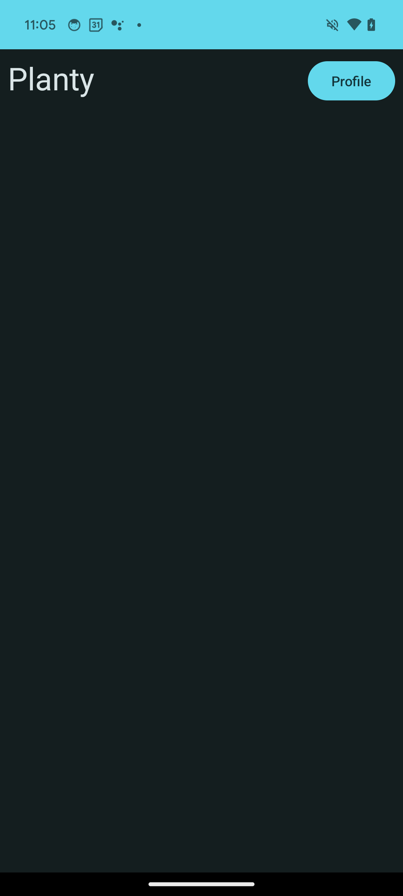
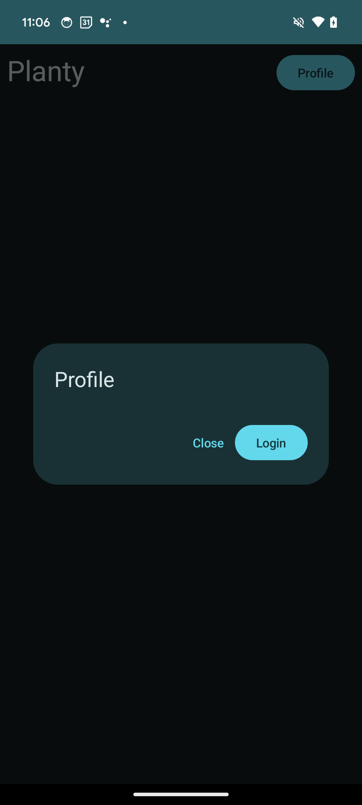
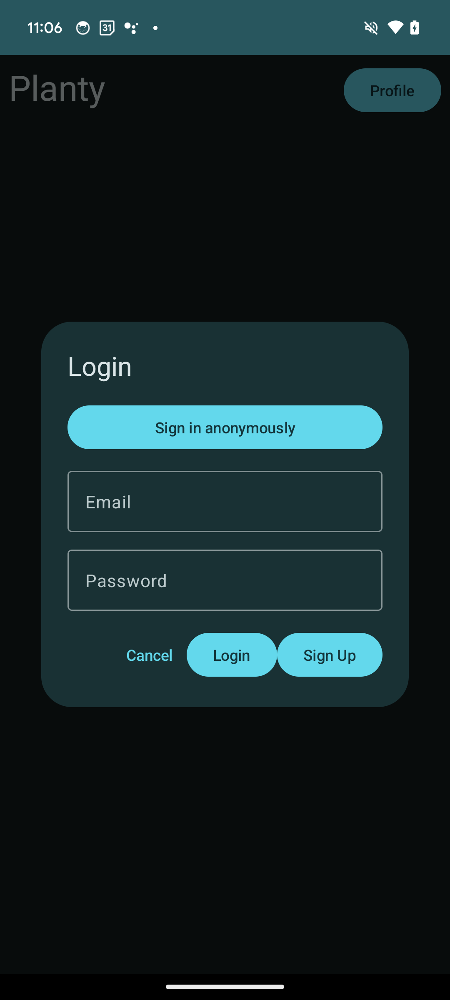
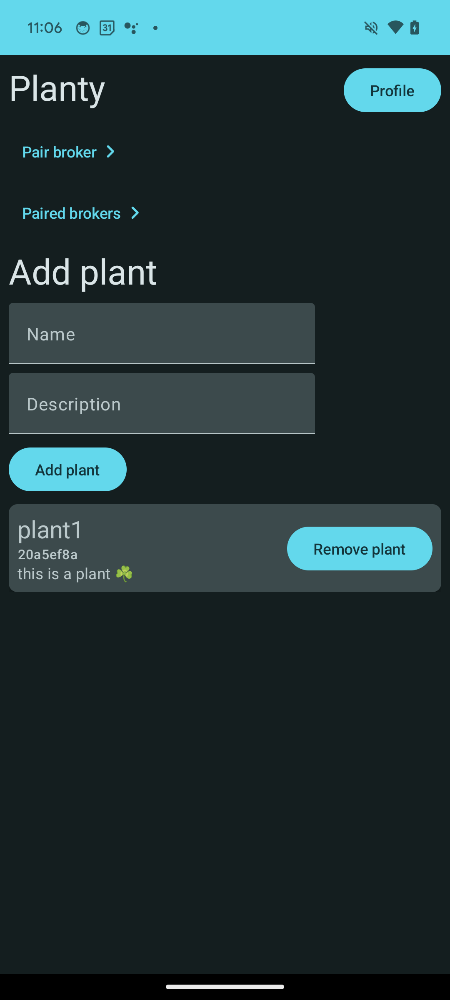
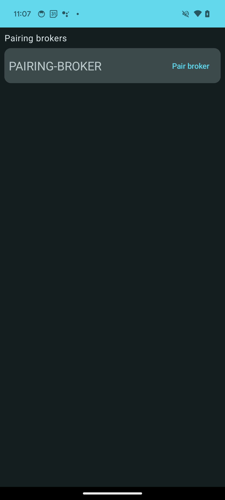
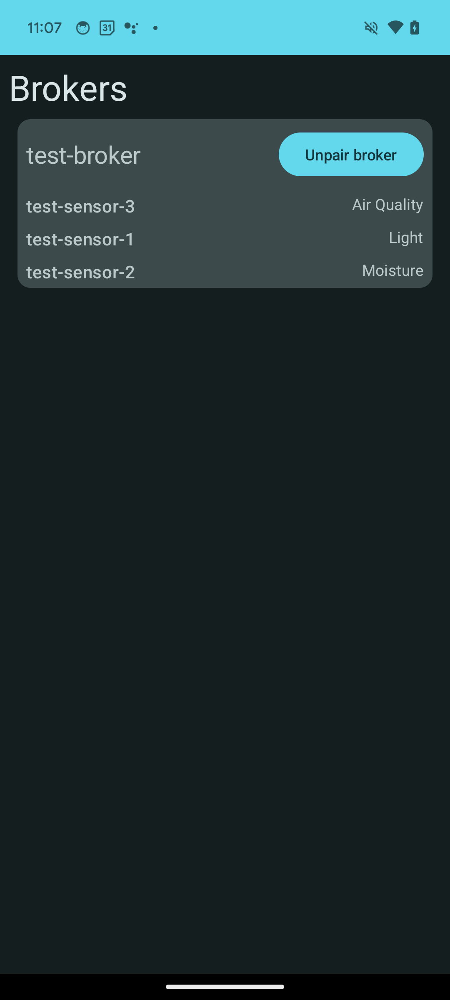
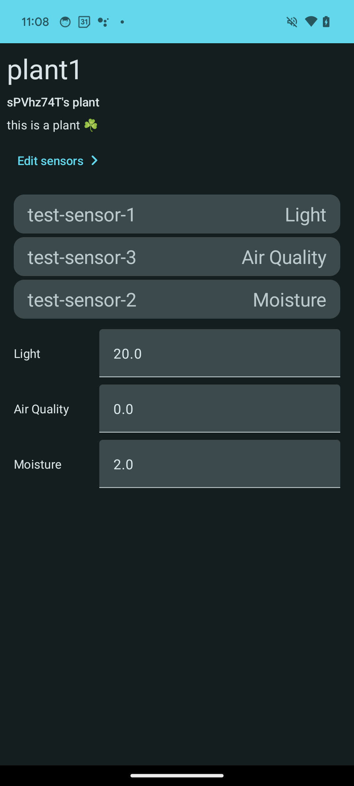
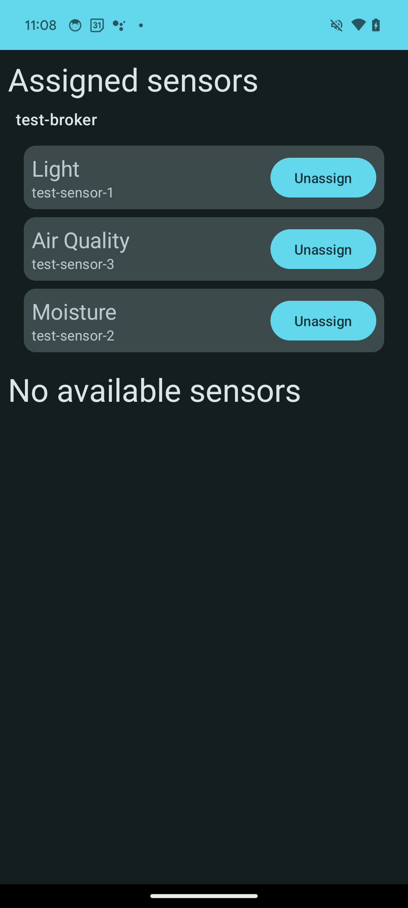
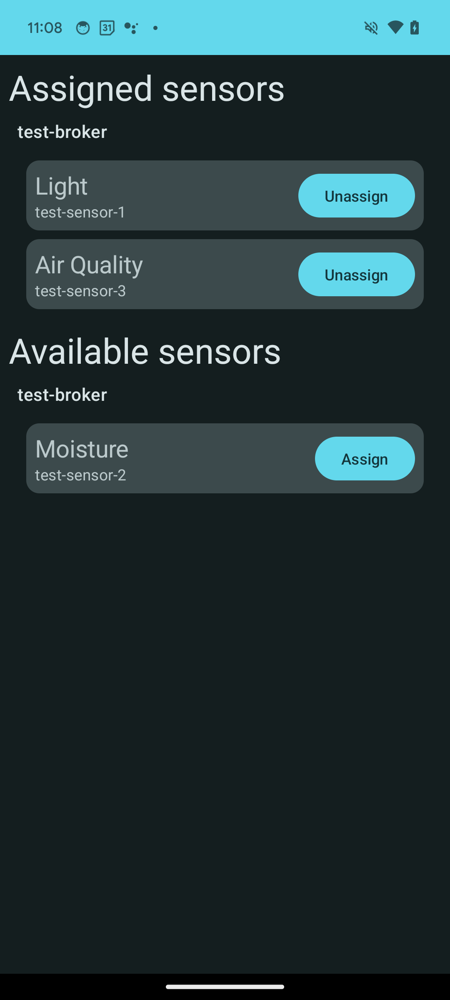
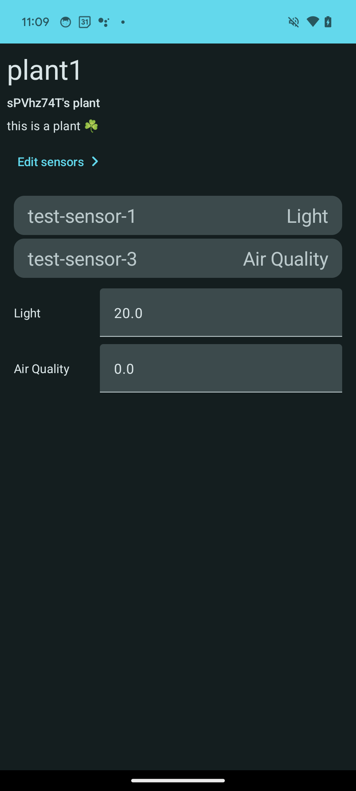

# How to use Planty App

This guide will show you and explain how to use the Planty app.

## Authentication

### Create an account

To create a new account, you can either use an email/password combination, or sign in anonymously.

#### Email/password sign in

1. Open the app.
2. Click on the `Profile` button.
3. Fill in your email/password.
4. Click on the `Sign In` button.
5. The app automatically logs you in.

#### Anonymous sign in

1. Open the app.
2. Click on the `Profile` button.
3. Click on the `Sign in Anonymously` button.
4. The app automatically logs you in with an anonymous account.

### Login

To login, you can use an existing email/password combination, or sign in anonymously. Keep in mind, that if you sign in anonymously, you will not be able to recover your data if you sign out.

#### Email/password login

1. Open the app.
2. Click on the `Profile` button.
3. Fill in your email/password.
4. Click on the `Login` button.

## Sign in user flow

### Home screen without user

When you open the app, you will be greeted with the home screen. If you are not logged in, you will see a screen like this:

### Profile screen

To sign in, click on the `Profile` button. You will see a screen like this:

### Login screen

To login, you can use an existing email/password combination, or sign in anonymously.

## Usage

After you logged in, you will see a screen like this:

You can see several things from top to bottom:

- `Pairing broker` button: This button is used to pair the broker with the app.
- `Paired brokers` button: This button is used to see the paired brokers.
- `Add plant` form: This form is used to add a new plant.
- `Plants` list: This list shows the plants you have added.

### Pairing broker screen

To pair a broker, click on the `Pairing broker` button. You will see a screen like this:

You can pair brokers shown on the list by clicking on the `Pair broker` button.

### Paired brokers screen

To see the paired brokers, click on the `Paired brokers` button. You will see a screen like this:

You can see the paired brokers on the list. You can remove a broker by clicking on the `Unpair broker` button. You can also see the sensors attached to the broker.

### Plant detail screen

To see the details of a plant, click on a plant in the `Plants` list. You will see a screen like this:

You can see several things from top to bottom:

- Plant name
- Plant owner
- Plant description
- Edit sensors button: This button is used to edit the sensors attached to the plant.
- Sensors list: This list shows the sensors attached to the plant.
- Desired environment list: This list shows the desired environment of the plant with key-value pairs. You can set numbers for specific types of sensors to control the environment of the plant. You have to wait 2.5 seconds after you set a value for the change to take effect.

### Edit sensors screen

To edit the sensors attached to the plant, click on the `Edit sensors` button. You will see a screen like this:

You can see several things from top to bottom:

- Assigned sensors list: This list shows the sensors attached to the plant.
- Available sensors list: This list shows the sensors available to attach to the plant.

You can attach a sensor to the plant by clicking on the `Assign` button. You can remove a sensor from the plant by clicking on the `Unassign` button. You can also see each sensor's types and identifiers.

If you remove a sensor from the plant, the sensor will be unassigned from the plant, but it will not be deleted from the broker. If you want to delete a sensor from the broker, you have to do it manually on the broker. You will see a screen like this if you unassign a sensor from the plant:

### Plant detail screen with unassigned sensor

If you unassign a sensor from the plant, you will see a screen like this:

You can see that you have removed the sensor from the plant and its type from the desired environment list.
