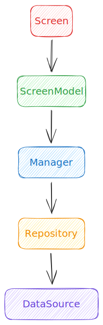

# Planty Multiplatform Client

This is the multiplatform client for the Planty project. It is written in Kotlin and uses the [Kotlin Multiplatform](https://kotlinlang.org/docs/reference/multiplatform.html) feature to share code between the Android, Web and Desktop clients.

## Client Architecture

Planty's architecture is based on several clean architecture principles, which aims to deliver a modern, highly expandable, robust development experience. There are multiple advantages and disadvantages of combining having a single codebase for multiple platforms and having to deal with the restrains of this singlular codebase:

- Multiplatform nature of the project allows for a single codebase to be used across multiple platforms, which reduces the amount of code that needs to be written and maintained.
- Limited number of multiplatform libraries and constaints of a single shared codebase are hard to digest, that is why architecture must be taken seriously in early stages of the project.

Planty's architecture aims to be as simple as possible, while still being able to provide basic features, like **navigation**, **data persistance** and **networking**.

### Model-View-ViewModel

The client is built using the Model-View-ViewModel (MVVM) architecture:



- `View`: The View is responsible for displaying the data to the user and for handling user input. It is implemented using the [Compose Multiplatform](https://www.jetbrains.com/lp/compose-multiplatform/) framework.
- `ViewModel`: The ViewModel is responsible for preparing and managing the data for the view. Data propagation is implemented using the [Kotlin Coroutines](https://kotlinlang.org/docs/reference/coroutines-overview.html) framework.
- `Manager`: The manager is responsible for handling business logic. It works with one-or-more `Repositories` to fetch data from.
- `Repository`: The Repository is responsible for handling data operations. It provides a clean API to the rest of the app to access app data from a single, platform independent domain (independent from underlying frameworks). It knows where to get the data from and what API calls to make when data is updated. It is relying on simpler `DataSources` to manage the data. It is implemented with the help of the [Store5](https://github.com/MobileNativeFoundation/Store) framework.
- `DataSource`: accesses the data from a single source, for example a database or a remote server. Local persistance is implemented using the [SQLDelight](https://github.com/cashapp/sqldelight) framework, remote persistance is implemented using the [Ktor](https://ktor.io/) framework.

## Navigation

Navigation is implemented using the pragmatic [Voyager](https://github.com/adrielcafe/voyager) library for [Compose Multiplatform](https://www.jetbrains.com/lp/compose-multiplatform/). It provides a simple and easy to use interface to setup user flows and nested navigation.

## Organization

The project is organized into several modules (or packages):

- `data`: contains data related `DataSource` and framework dependent classes.
  - `local-framework-name`: contains local data persistance classes.
  - `remote-framework-name`: contains remote data persistance classes.
- `ui`: contains UI related classes. Single screen is organized into a single package.
  - `screen-name`: contains the file for a single screen.
    - `model`: contains the data models used to build up the screen UI.
- `repo`: contains `Repositories`.
  - `model`: contains the data models, independent from `DataSource` class implementations.
- `manager`: contains `Manager` classes.
- `di`: contains dependency injection related classes, like `AppModule.kt` and `PlatformModule.kt` containing the factories for dependency injections in case of `Koin`. Other classes may contain submodules for dependency injection.
- `util`: additional classes that are used across the project.

This structure can be altered if needed, but it is recommended to keep it as simple as possible. Singleton-like classes (`Activity` in case of Android, or `Main` in case of Desktop can be placed in the root of the package).

## Development

Few things to keep in mind when developing the project.

Have your JDK compatible with 17 version. If using Android Studio (recommended for development) you can download and set it there. This is required to build.

It is recommended to enable `Settings` -> `Experimental` -> `Configure all Gradle tasks during Gradle Sync` inside Android Studio to help you figure out what task can you run. This way, you can easily run your desired `run` or `build` task from the `Gradle` tab.

### Android

Have your Android SDK installed and set up. You can download it from Android Studio. Your emulator should support API 21 (Android 5.0 Lollipop) or higher.

### Desktop

Desktop app is based on Java Swing under the hood. Due to a [dependency issue](https://github.com/adrielcafe/voyager/issues/147) related to [Voyager](https://github.com/adrielcafe/voyager), all `Coroutine` calls must be dispatched explicitly with a `CoroutineDispatcher`. Otherwise, the desktop app will crash.

#### Bad

```kotlin
screenModelScope.launch {
    clickManager.incrementClickCount()
}
```

#### Good

```kotlin
screenModelScope.launch(dispatcherIO) {
    clickManager.incrementClickCount()
}
```

### Web

When changing dependencies, run `./gradlew kotlinUpgradeYarnLock` to update the `yarn.lock` file. Android Studio will throw a compile time error prompting the user to run this command if dependencies are out of date.
